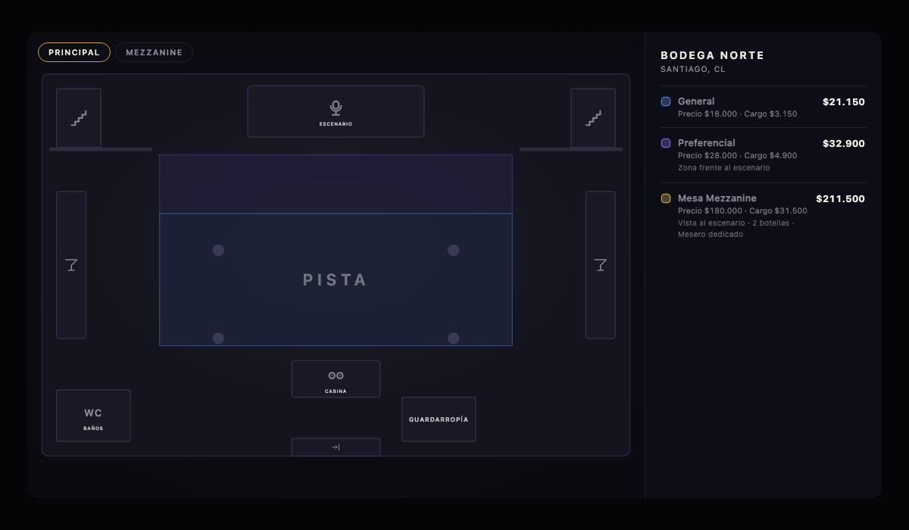
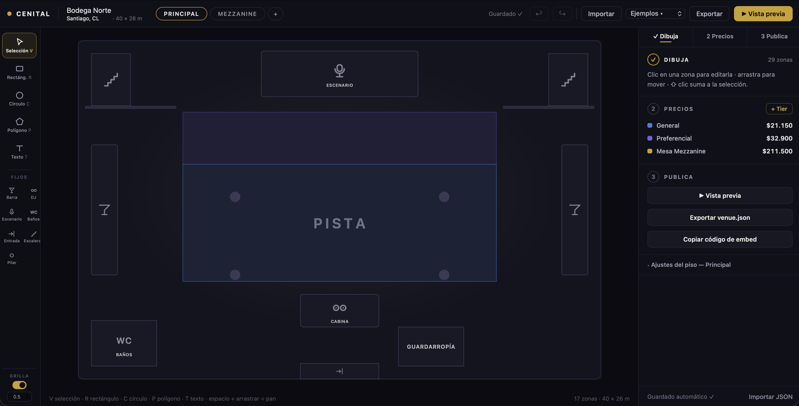

# mapa-discos 🪩


Mapas cenitales de discotecas y venues nocturnos: un **builder** visual para dibujar el layout
del club con sus tiers de precio, y un **viewer** embebible, sin dependencias, para tu sitio de
venta de entradas.

Todo el venue vive en **un solo archivo JSON** (`venue.json`, contrato en
[`schema.md`](./schema.md)). El builder es una comodidad para producir ese JSON; el viewer es un
renderer del mismo. Podés escribir el JSON a mano en cualquier editor y obtener un mapa
funcional — la GUI nunca es obligatoria.

| Viewer (embebido en tu sitio) | Builder (editor visual) |
|---|---|
|  |  |

## Cómo funciona

```
builder ──produce──▶  venue.json  ◀──lo escribís a mano si querés
                          │
viewer ◀──renderiza───────┘        tu sitio escucha eventos `select` y arma el carrito
```

- **Zonas**: áreas de pie (pista, general), mesas VIP (se venden como unidad), fixtures
  (barra, DJ, escenario, baños…) y paredes. Rectángulos (con rotación), círculos y polígonos.
- **Tiers**: el precio vive en el tier (`precio + cargo por servicio`), las zonas apuntan a un
  tier. Leyenda con precios formateados vía `Intl.NumberFormat` — por defecto `es-CL` + CLP
  (`$ 250.000`).
- **Estados por zona**: `available` / `limited` / `soldout` / `reserved`, cambiables en vivo
  desde tu código (`map.setStatus('vip-a', 'soldout')`).
- **Multi-piso**, tooltips, pan/zoom, tema dark/light, accesible por teclado y lector de pantalla.

## Quickstart

```sh
npm install          # solo esbuild (herramienta de dev; el viewer no tiene deps en runtime)
npm run check        # valida los ejemplos + self-checks de geometría
npm run build        # bundlea el viewer en dist/
npm run serve        # servidor estático en http://127.0.0.1:8123
```

`http://127.0.0.1:8123` muestra un índice con links a todo:

| URL | Qué es |
|---|---|
| `/src/builder/index.html` | el builder (`?ejemplo=club-intimo` precarga un ejemplo) |
| `/src/preview.html` | viewer pelado (`?venue=../examples/rooftop.json`, `?theme=light`) |
| `/src/demo/index.html` | checkout falso con carrito manejado por los eventos del viewer |
| `/scripts/e2e.html`, `/scripts/builder-e2e.html` | self-checks de comportamiento (cada línea debe decir PASS) |

Módulos ES nativos — sirve cualquier servidor estático; `file://` no funciona.

## Embeber el viewer

Copiá `dist/venue-map.js` + `dist/venue-map.css` (y tu `venue.json`) a cualquier proyecto.
Sin framework, sin dependencias, sin llamadas de red en runtime.

```html
<link rel="stylesheet" href="venue-map.css">
<div id="venue-map" style="height: 600px"></div>
<script type="module">
  import { VenueMap } from './venue-map.js';

  const map = new VenueMap('#venue-map', {
    url: './venue.json',     // o data: <objeto inline>
    interactive: true,
    multiSelect: true,
  });

  map.on('select', ({ zone, tier, selected, selection }) => {
    // manejá tu carrito desde acá
  });
</script>
```

Dale una altura al contenedor — el mapa lo llena en cualquier aspect ratio sin distorsionar.

### Opciones

| opción | default | notas |
|---|---|---|
| `data` | — | objeto JSON del venue (se valida al cargar) |
| `url` | — | fetch del JSON (`map.ready` resuelve cuando cargó) |
| `interactive` | `true` | `false` = imagen estática: sin pan/zoom, hover, foco ni eventos |
| `selectable` | `true` | permite seleccionar zonas (forzado a off si no es interactivo) |
| `multiSelect` | `false` | mantiene varias zonas seleccionadas |
| `showLegend` | `true` | panel de leyenda de tiers (bottom sheet en pantallas ≤640px) |
| `showTooltips` | `true` | tooltip al hover con label/tier/precio/capacidad/estado |
| `theme` | `'dark'` | `'dark'`, `'light'`, o un objeto de overrides de variables CSS (`{ bg: '#000' }`) |
| `locale` | `'es-CL'` | locale de formato de precios (la moneda viene del JSON) |
| `floor` | primer piso | id del piso inicial |
| `onSelect` / `onHover` | — | atajos para los eventos de abajo |

### Eventos (`map.on(evento, fn)`)

- `select` → `{ zone, tier, selected, selection }` — dispara al seleccionar *y* deseleccionar
- `hover` → `{ zone, tier }`
- `floorchange` → `{ floor }`

### Métodos

`ready` (promesa) · `on` / `off` · `select(id)` / `deselect(id)` / `getSelection()` ·
`highlightTier(tierId | null)` · `setStatus(id, 'available' | 'limited' | 'soldout' | 'reserved')` ·
`setFloor(id)` · `destroy()`. El módulo también exporta `validate(json)` / `formatErrors(errors)`.

`setStatus('vip-a', 'soldout')` apaga la zona, bloquea la selección y — si estaba seleccionada —
la deselecciona y dispara `select` con `selected: false`, así el carrito queda sincronizado gratis.

### Theming

Todo lo visual cuelga de custom properties `--vm-*` en `.vmap` (`bg`, `floor`, `wall`,
`outline`, `text`, `muted`, `accent`, `focus`, `panel-bg`, `panel-border`, `tooltip-bg`,
`tooltip-text`, `radius`, `soldout-mute`, `font`). Sobrescribilas desde el CSS del host, por
venue vía `venue.theme` en el JSON, o por instancia vía la opción `theme`. Los colores de los
tiers son datos, no tema.

## Escribir un venue a mano

Leé [`schema.md`](./schema.md) — el contrato completo entra en una página. Partí del ejemplo
mínimo de ahí, o copiá de [`examples/`](./examples): `club-intimo.json` (club chico, forma
corta de un solo piso), `warehouse.json` (dos pisos, estados), `rooftop.json` (densidad de
mesas VIP, precios con descuento). Los errores de carga son legibles y nombran la zona exacta
y cómo arreglarla.

## Decisiones

- **Vanilla JS + módulos ES nativos, sin framework.** La complejidad del builder es geometría,
  no estado de UI. La única herramienta es esbuild, que bundlea el viewer a un archivo; el
  builder corre sin bundlear en el browser. Ambos comparten los módulos de `src/core/` — el
  canvas del builder y el viewer renderizan las zonas por el mismo código, así que la fidelidad
  del "preview" es estructural.
- **Desvíos del schema respecto al sketch original** (detalles en `schema.md`): los campos de
  forma van planos sobre la zona (sin objeto `shape: {}` anidado); la moneda vive en `venue`,
  no por tier; el orden de pintado lo fija el tipo de zona (sin z-index); las formas `path` son
  un escape solo-viewer (el builder las preserva pero solo `polygon` se dibuja/edita).
- **Las mesas se venden como unidad** — `capacity` es informativo. Venta por asiento sería un
  tema de schema v2.
- **Cortes deliberados del builder**: sin UI de z-order, sin guías magnéticas (botones de
  alinear/distribuir en su lugar), sin resize/rotate grupal, sin inserción de puntos medios en
  polígonos, sin modales. Los rects rotados se redimensionan bien (la esquina opuesta queda
  fija) vía `core/geometry.js`.

## Estructura

```
schema.md                    el contrato de venue.json
examples/                    tres venues completos (también fixtures de test del schema)
dist/                        el artefacto embebible: venue-map.js + venue-map.css
src/core/                    compartido: validación, geometría, render SVG, panzoom, dinero
src/viewer/                  VenueMap + leyenda/tooltip/a11y + venue-map.css
src/builder/                 la app de edición
src/demo/                    checkout falso embebiendo dist/
scripts/check.mjs            self-check en node (schema + geometría)
scripts/*-e2e.html           checks de comportamiento en browser
```

## Licencia

[MIT](./LICENSE)
